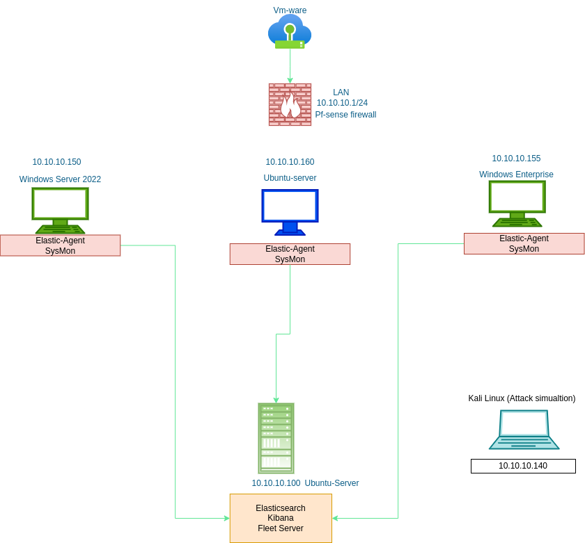

# SIEM-Home-Lab 

## Objectives

This lab simulates a network environment designed for monitoring and detection using the Elastic Stack. The setup includes:

- **Windows Server 2022 (10.10.10.150)**: Running Elastic-Agent and Sysmon for collecting logs and system events.
- **Ubuntu Server (10.10.10.160)**: Configured with Elastic-Agent and Sysmon for monitoring.
- **Windows Enterprise (10.10.10.155)**: Running Elastic-Agent and Sysmon to track events.
- **Kali Linux (10.10.10.140)**: Used for attack simulations to test the detection capabilities of the SIEM.
- **Elastic Stack Server (10.10.10.100)**: Hosted on Ubuntu, running Elasticsearch, Kibana, and Fleet Server for log aggregation, visualization, and alerting.
- **PfSense Firewall**: Secures the network and connects to the internal LAN (10.10.10.1/24) under VMware virtualization.

This setup allows for real-time monitoring and testing of security events using Sysmon data from all connected systems, with the goal of improving detection and response capabilities.

## Setting Up Elasticsearch, Kibana, Fleet, and Installing Elastic-Agent on All Endpoints

